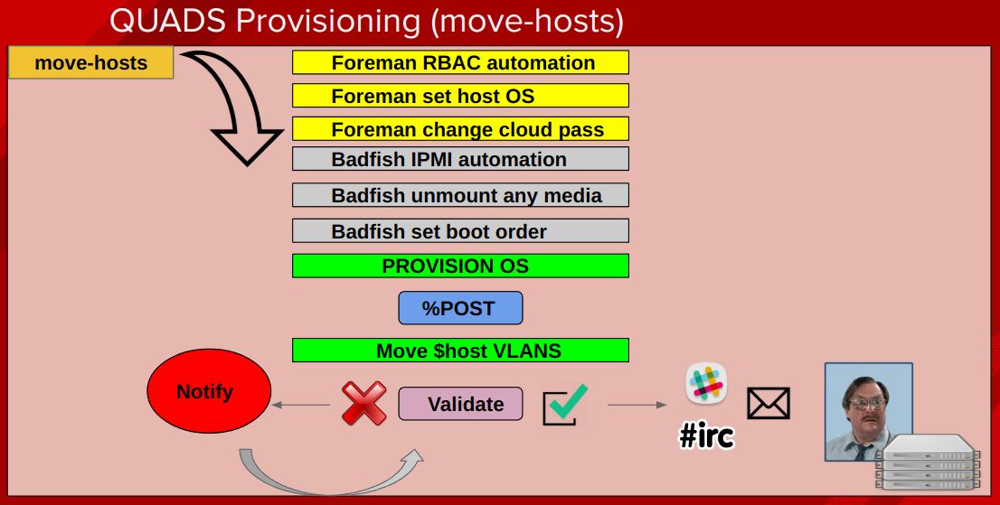
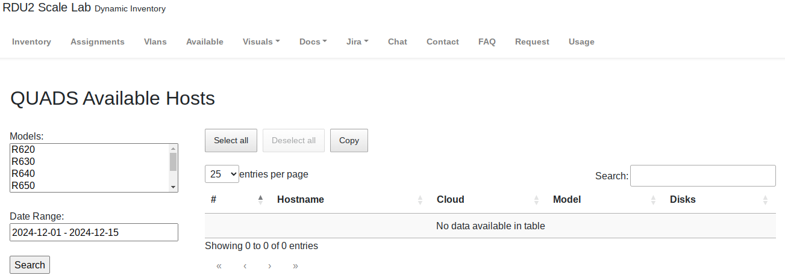

# QUADS Architecture, Workflow and Visuals

Below are common workflows, visualizations and features of QUADS.

* [QUADS Workflow and Examples](#quads-workflow-and-visuals)
    * [QUADS Architecture](#quads-architecture)
    * [QUADS Data Structure](#quads-data-structure)
    * [QUADS Foreman Provisioning Workflow](#quads-foreman-provisioning-workflow)
    * [QUADS Move and Rebuild Provisioning UML](#quads-move-and-rebuild-provisioning-uml)
    * [Example: Automated Scheduling](#example-automated-scheduling)
    * [Example: Systems Wiki](#example-systems-wiki)
    * [Example: Workload Assignments](#example-workload-assignments)
    * [Example: Systems Availability Search](#example-systems-availability-search)
    * [Example: Systems Visualization Map](#example-systems-visualization-map)
    * [Example: IRC, Webhook Chat and Email Notifications](#example-irc-webhook-chat-and-email-notifications)

## QUADS Architecture


## QUADS Data Structure
This is how our scheduling data, collections and data model look like within PostgreSQL.


## QUADS Foreman Provisioning Workflow
This is the workflow behind `quads/tools/move_and_rebuild.py`



## QUADS Move and Rebuild Provisioning UML
This is a UML chart illustrating all the API, host, switch and foreman workflows that happen when systems and networks are built and moved.


## Example: Automated Scheduling


## Example: Systems Wiki


## Example: Workload Assignments


## Example: Workload Assignments Readiness
We color-code progress bars and status based on total amount of completion for an entire assignment.


## Example: Systems Availability Search
`quads-web` offers current and future availability search and filtering by hardware components like disk, model or any hardware metadata supported by the [hardware metadata framework](quads-host-metadata-search.md)



## Example: Systems Visualization Map


## Example: IRC, Webhook Chat and Email Notifications
   - We can notify any Chat Platform webhook or IRC supybot plugin when new environments are released.
   - We send email notifications when new environments are defined.
   - We also send email notifications with the host list for the environment 7 days prior to activation.
   - Furthermore we send email notifications when new environments are provisioned.

```
QUADS: cloud08: 32 (OCP Hybrid RDS Scale) is now active, choo choo! - https://quads.example.com/assignments/#cloud08 - jdoe
```

```
Greetings Citizen,

You've been allocated a new environment!

cloud06 : 13 (OVN and OpenStack ML2/OVS)

(Details)
http://wiki.example.com/assignments/#cloud06

```
   - Lastly we send notifications 7, 5, 3, 1 days out from when assignments expire (or any number of machines are set to be removed during the current assignment schedule).
   - You can use the fields ```--cloud-owner``` and ```--cc-users``` to define who gets notifications.
```
This is a message to alert you that in 7 days
your allocated environment:

cloud08 : 29 (JBOSS Data Grid)

(Details)
http://wiki.example.com/assignments/#cloud08

will have some or all of the hosts expire.  Some or all of your
hosts will automatically be reprovisioned and returned to the
machine pool.

b01-h05-r620.example.com
b01-h06-r620.example.com
b02-h01-r620.example.com

```
